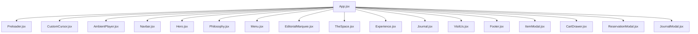

# Architecture & Component Model

## System Overview
Morrow Café is structured as an unbundled, high-performance React application rendered using Vite 6 and Framer Motion.

```mermaid
flowchart TD
    App[App.jsx] --> Preloader[Preloader.jsx]
    App --> CustomCursor[CustomCursor.jsx]
    App --> AmbientPlayer[AmbientPlayer.jsx]
    App --> Navbar[Navbar.jsx]
    App --> Hero[Hero.jsx]
    App --> Philosophy[Philosophy.jsx]
    App --> Menu[Menu.jsx]
    App --> Marquee[EditorialMarquee.jsx]
    App --> TheSpace[TheSpace.jsx]
    App --> Experience[Experience.jsx]
    App --> Journal[Journal.jsx]
    App --> VisitUs[VisitUs.jsx]
    App --> Footer[Footer.jsx]
    App --> ItemModal[ItemModal.jsx]
    App --> CartDrawer[CartDrawer.jsx]
    App --> ResModal[ReservationModal.jsx]
    App --> JournalModal[JournalModal.jsx]
```
